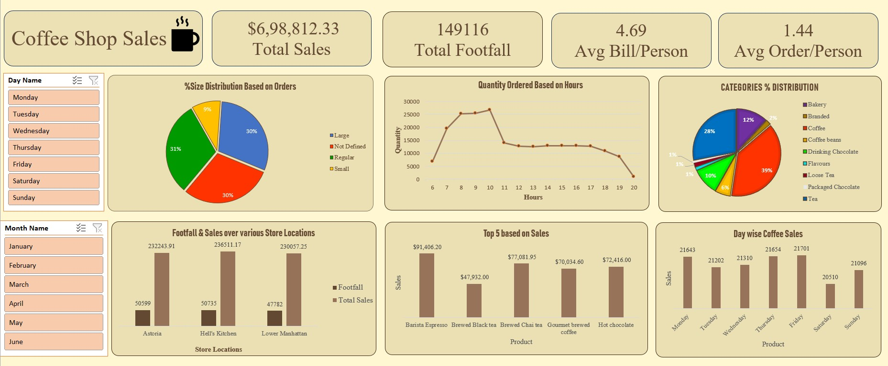

# ☕ Coffee Shop Sales Dashboard 📊

Welcome to the **Coffee Shop Sales Dashboard** project!  
This project is built to analyze retail coffee sales data and uncover insights that drive smarter business decisions — all within **Excel** using **Power Query**, **Pivot Tables**, and **Interactive Charts**.

 

---

## 🎯 Objective  
To transform raw sales data from a coffee shop chain into a clean, visual, and interactive **Excel Dashboard**, enabling stakeholders to:

- Understand customer behavior
- Optimize store performance
- Identify best-selling products and peak hours

---

## 🧠 Key Insights  
- 📅 **Day-wise & Hour-wise Trends** – Visualized customer footfall and order quantity by time slots  
- 🏪 **Location Analysis** – Compared sales and footfall across multiple store locations  
- 🥇 **Top-Selling Products** – Identified products with the highest sales and revenue  
- 💸 **Revenue Metrics** – Calculated Total Sales, Average Bill per Person, and Average Order per Person  
- 📦 **Product Category Distribution** – Evaluated which product categories are most popular among customers  

---

## 🛠️ Tools & Technologies Used  
- **Microsoft Excel**  
- **Power Query** (ETL process)  
- **Pivot Tables & Charts**  
- **Data Cleaning & Transformation Techniques**  
- **Dashboard Design & Visualization**

---

## 📂 Project Structure  
